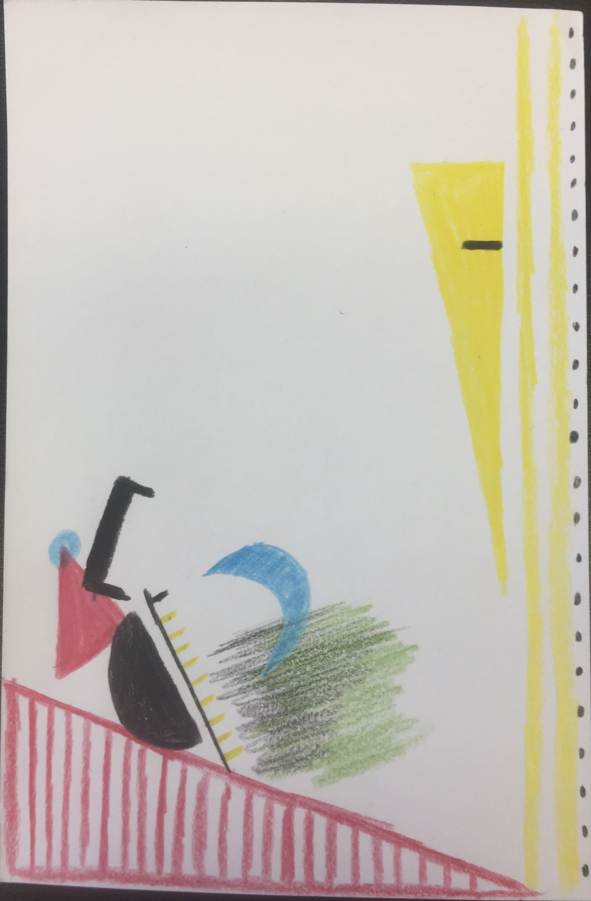

# Sam Pavlekovsky

I am a second year MSCAPP student at Harris. My policy interests center around energy and the environment, cities and sustainable urban design, and international development. I also attended UChicago for undergrad, graduating in 2020 with a degree in Computational and Applied Math (like Data Science). I am from a northern suburb originally. Outside of Harris, my interests include language and linguistics, choir, and cooking international foods - or traveling to eat those foods, if I can!

This subdirectory contains practice files for HTML and my Data Selfie image, which displays some facts about my life and personality following a standard guide.

Here is my Data Selfie:

