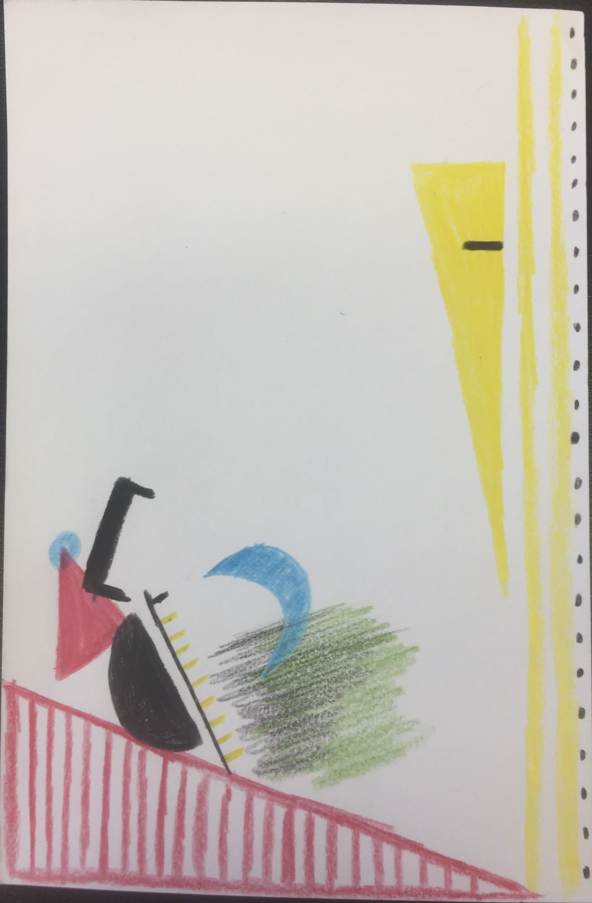

# Sam Pavlekovsky

## Week 1

### Introduction
I am a second year MSCAPP student at Harris. My policy interests center around energy and the environment, cities and sustainable urban design, and international development. I also attended UChicago for undergrad, graduating in 2020 with a degree in Computational and Applied Math (like Data Science). I am from a northern suburb originally. Outside of Harris, my interests include language and linguistics, choir, and cooking international foods - or traveling to eat those foods, if I can!

Here is my Data Selfie. It displays some facts about my life and personality following a set of [instructions from Georgia Lupi](https://ideas.ted.com/how-to-draw-your-own-selfie-using-your-personal-data/).

### Directory Contents
| Homework | Class |
| ----------- | ----------- |
| Data Selfie Image | [Introduction to HTML](./class/index.html) |