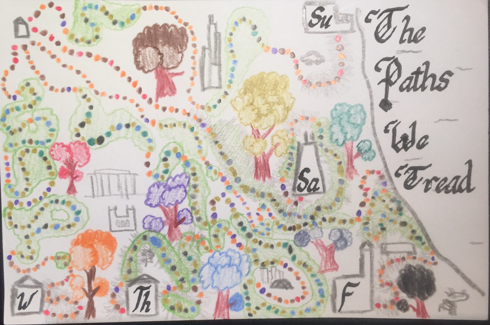
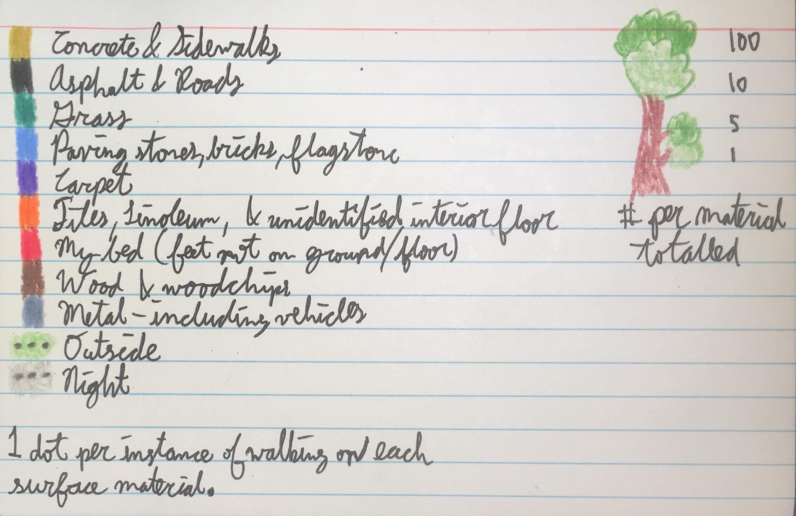

I kept track of what surface material I was walking on (or what was under my feet, if I wasn't walking).

Hopefully the text is legible! I think my postcard is on the busier side, more like a picture than clear data (then again, that's how I felt about many of the original postcards). My original plan was to draw colored line segments to outline buildings of the quad, including some aspect of duration, but it was too hard to work out the necessary length to cover the whole quad :(. Also, this project has revealed to me my great inability to tell different floor materials apart.
